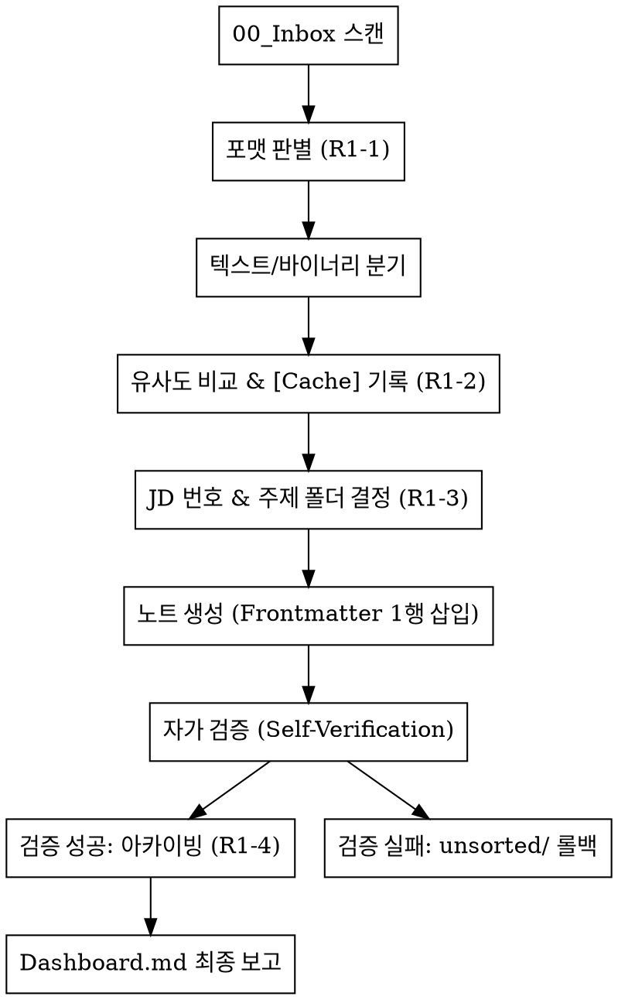

# New File Processor

## Overview
`00_Inbox`에 유입된 신규 파일을 식별하고, Johnny.Decimal 체계와 Sidecar 규칙에 따라 자동으로 분류, 컴파일, 아카이빙하는 강제 워크플로우입니다.

## When to Use
- `00_Inbox`에 처리되지 않은 신규 파일이 존재할 때
- 사용자가 `/defrag:new-file-process`, `/defrag:nfp` 또는 "인박스 처리해줘"라고 요청할 때
- `unsorted/` 디렉토리에 있는 파일을 재배치해야 할 때

## Core Workflow (Rigid)

이 스킬은 **`R1_ingest.md`** 및 **`R2_search.md`**의 절차를 엄격히 준수하며, 단계를 생략할 수 없습니다. 특히 "유사도 비교" 단계에서는 **3단계 탐색 프로토콜**을 필수적으로 거쳐야 합니다.



## Quick Reference

| 단계 | 핵심 액션 | 주요 산출물/로그 |
| :--- | :--- | :--- |
| **준비** | `R1_ingest.md`, `R6_metadata.md`, `R2_search.md` 로드 | - |
| **1단계** | 텍스트 vs 바이너리 판별. **텍스트(.md, .txt)는 분량에 관계없이 2단계 직행** | - |
| **2단계** | 유사도 스캔 (3단계 탐색 프로토콜 적용) | Dashboard `[Cache]` 기록 |
| **3단계** | Johnny.Decimal 번호 + 주제 폴더 배치 | MD 노트 생성/통합, Frontmatter 작성 |
| **4단계** | **자가 검증(Self-Verification)**: `read_file`로 템플릿 정합성 확인 | **필수 필드 누락 시 롤백** |
| **5단계** | 위키 이동 후 원본 삭제 (텍스트) 또는 Archive 이동 (바이너리) | `location` (Obsidian URI) 갱신 |

## Tool Usage Hierarchy (도구 활용 우선순위)

모든 작업 수행 시 아래 계층 구조를 따르되, **파일 크기, 작업 유형, Alias 위험**에 따른 예외 조항을 엄격히 준수합니다.

### 1. 계층별 우선순위
1.  **1순위: Obsidian CLI** (`obsidian eval`, `obsidian search`)
    - 볼트 내 메타데이터 쿼리, 인덱스 분석, 그래프 탐색 등 볼트 특화 로직에 최우선 활용.
2.  **2순위: OS 표준 명령어** (`run_shell_command` 활용 - `mv`, `cp`, `ls`, `cat` 등)
    - 파일 이동(`mv`), 복사(`cp`), 목록 확인 등 물리적 작업 및 **소형 파일** 조회에 활용.
3.  **3순위: 에이전트 전용 도구** (`read_file`, `replace`, `write_file`, `grep_search`)
    - 정밀 수정, **대형 파일** 부분 읽기, 컨텍스트 최적화가 필요한 복잡한 작업에 활용.

### 2. 임계치 기반 예외 및 위험 관리 (Critical)

| 상황 | 최적 도구 | 근거 및 예외 조항 |
| :--- | :--- | :--- |
| **파일 이동/이름 변경** | `mv` (OS) | 가장 효율적. `read_file` -> `write_file` -> `rm` 방식 절대 금지. |
| **소형 파일 조회 (< 100줄/10KB)** | `\cat` (OS) | 빠른 조회 가능. **반드시 `\`를 붙여 Alias(`bat` 등)로 인한 라인 넘버/색상 코드 삽입 방지.** |
| **대형 파일 조회 (> 100줄/10KB)** | `read_file` (Agent) | `cat` 사용 시 응답 절단 위험. `start_line/end_line`으로 범위를 지정하여 읽기. |
| **내용 수정 (Surgical Edit)** | `replace` (Agent) | `sed` 등 OS 명령어는 정확도가 낮고 위험함. 정밀 수정은 에이전트 도구 우선. |
| **편집용 데이터 확보** | `read_file` (Agent) | 조회 후 `replace`를 수행할 계획이라면, 쉘 환경 변수 차단을 위해 OS 명령어보다 에이전트 도구 우선 활용. |

### 3. Safety Checkpoints
- **Alias Bypass**: `run_shell_command`에서 텍스트 조회 시 반드시 `\cat` 또는 `command cat`을 사용하여 Raw 데이터를 확보하십시오.
- **응답 절단 방지**: 로그 파일 등 거대 파일 조회 시 절대 `cat`이나 매개변수 없는 `read_file`을 사용하지 마십시오.
- **물리적 무결성 및 인덱스 갱신**: 파일 이동(`mv`) 후에는 반드시 `ls`로 존재를 확인하고, **Obsidian CLI를 사용하여 볼트 인덱스를 갱신하십시오.**
  - **권장 명령어**: `obsidian eval "app.vault.adapter.fs.promises.readdir('.')"` (루트 스캔 유도) 또는 `app.workspace.requestSave()`를 호출하여 상태를 동기화하십시오.

## 구현 가이드 (Implementation)

### 1. Frontmatter 기계적 삽입 (Standard YAML Template)
노트 생성/수정 시 아래 템플릿을 **반드시 1행부터 정확히 삽입**하십시오. 에이전트의 임의 요약이나 필드 생략은 금지됩니다.

```yaml
---
id: {{YYYYMMDDHHmm_KST}}
title: {{파일명}}
type: tech | project | admin | source | synthesis | output
tags: [키워드1, 키워드2] # 최소 2개 필수
status: active | idea | deprecated
location: "obsidian://open?vault=defrag&file=[URL_Encoded_Path]"
created: {{date}}
updated: {{date}}
---
```

### 2. 자가 검증 및 롤백 (Self-Verification & Rollback Protocol)
모든 `write_file` 또는 `replace` 작업 직후에는 아래 **도구 계층**을 준수하여 기계적으로 검증을 수행하십시오.

1. **검증 단계 (Read & Verify)**:
   - **소형 파일/상단 확인**: `\cat` 또는 `\head` (2순위)를 사용하여 Frontmatter의 존재와 정합성을 즉시 확인하십시오.
   - **정밀 검증**: 내용이 복잡하거나 대형 파일인 경우 `read_file` (3순위)로 정밀 검증을 수행하십시오.
   - **체크리스트**: `id`, `title`, `type`, `tags`, `status`, `location` 필드가 모두 존재하며 유효한 데이터가 채워져 있는가? 본문이 훼손되지 않았는가?

2. **롤백 단계 (Rollback)**:
   - **검증 실패 시**: 즉시 작업을 중단하고 `mv` (2순위)를 사용하여 원본을 `00_Inbox/unsorted/`로 되돌리십시오.
   - **로그 기록**: Dashboard.md에 에이전트 도구(3순위)를 사용하여 `[Log] 검증 실패: 파일명 (사유: Frontmatter 정합성 위반)`을 기록하십시오.

3. **최종 확정 및 동기화 (Sync)**:
   - 파일 이동 완료 후 `ls` (2순위)로 물리적 위치를 확인한 뒤, **`obsidian eval` (1순위)** 명령어로 볼트 인덱스를 즉시 갱신하여 데이터 정합성을 확보하십시오.

### 3. 검색 최적화 (Search Optimization)
R1-2의 유사도 비교 스캔을 수행할 때는 반드시 아래 3단계를 순차적으로 적용합니다. (전역 검색부터 실행 금지)
1. **인덱스 스캔:** 유력한 프로젝트 도메인(예: `30_index.md`)만 확인.
2. **디렉토리/파일명 탐색:** `list_directory`, `glob`를 통해 폴더 하위의 파일 목록만 빠르게 확인.
3. **전역 본문 탐색:** 앞의 두 단계로 확인할 수 없는 경우만 `grep_search` 사용.

### 4. 프로젝트 번호 할당 (Johnny.Decimal)
- 기존 프로젝트: 기존 번호(예: `30_`) 유지.
- 신규 프로젝트: 해당 영역의 **최대 번호 + 1** 할당 (예: `31_`).

### 5. Sidecar `location` 필드 (Obsidian URI)
- 반드시 **URL Encoding**된 Obsidian URI를 사용합니다.
- 포맷: `obsidian://open?vault=defrag&file=[Encoded_Path]`

## Automation Policy (Non-interactive Mode)
이 스킬이 비대화형 환경(Headless Mode)에서 실행될 때, `R8_security.md`의 "사용자 확인 요청"이 필요한 상황(모호성, 보안 위험 등)에 직면하면 아래 절차를 따릅니다.

1. **중단 금지**: `ask_user`를 호출하여 실행을 멈추지 않습니다.
2. **안전한 폴백(Fallback)**: 해당 파일을 즉시 `00_Inbox/unsorted/`로 이동시킵니다.
3. **사후 기록**: Dashboard.md에 `[Log] (파일명) 처리 보류: (사유 - 예: PII 감지, 도메인 판단 불가)`를 남기고 즉시 다음 파일 처리를 진행합니다.
4. **결과 보고**: 모든 루프가 끝난 후, 처리 완료 건수와 'unsorted'로 이동된 건수를 요약 보고합니다.
5. **침묵 유지 (Silence on Empty)**: 처리할 신규 파일이 하나도 없는 경우, Dashboard.md를 포함한 어떠한 곳에도 로그를 남기지 않고 즉시 종료합니다.

## Common Mistakes
- **비효율적 도구 체이닝**: 파일 이동 시 `read_file` -> `write_file` -> `rm` 순으로 작업하지 마십시오. 반드시 **2순위 도구인 `mv`** 명령어를 사용하십시오.
- **Alias 및 포맷 오염**: `cat`을 이스케이프(`\cat`) 없이 사용하여 라인 넘버나 ANSI 색상 코드가 포함된 데이터를 처리하지 마십시오. 이는 후속 `replace` 작업의 실패 원인이 됩니다.
- **대형 파일 조회 오류**: 100줄 이상의 파일에 `cat`을 사용하지 마십시오. 응답이 절단되어 데이터 손실이 발생할 수 있습니다.
- **주제 폴더 누락 및 번호 금지**: 프로젝트 루트(예: `30_Project-X/`)에 파일을 직접 두지 마십시오. 반드시 `참고자료`, `회의록` 등 하위 폴더를 생성하십시오. **하위 주제 폴더명에는 `[번호]_` 접두사를 절대 붙이지 마십시오.** (예: `10_Admin/Network/` (O), `10_Admin/10_Network/` (X))
- **Cache 기록 누락**: 수집 시작 시 Dashboard에 `[Cache]`를 남기지 않으면 중복 수집의 원인이 됩니다.
- **절대 경로 사용**: `location`에 OS 절대 경로를 절대 사용하지 마십시오.
- **무분별한 전역 검색**: 파일명 스캔 과정 없이 파일 내용 검색(`grep_search` 등)부터 실행하면 막대한 토큰 낭비가 발생합니다.

## Red Flags
- "바쁘니까 아카이빙은 나중에 할게요" (즉시 아카이빙이 원칙)
- "주제 폴더가 애매해서 루트에 둘게요" (반드시 '일반' 또는 '기타' 폴더라도 생성)
- "비슷한 파일이 있는지 확인하기 위해 전역 검색부터 돌렸어요" (위험! 1-2단계 스캔 선행)
