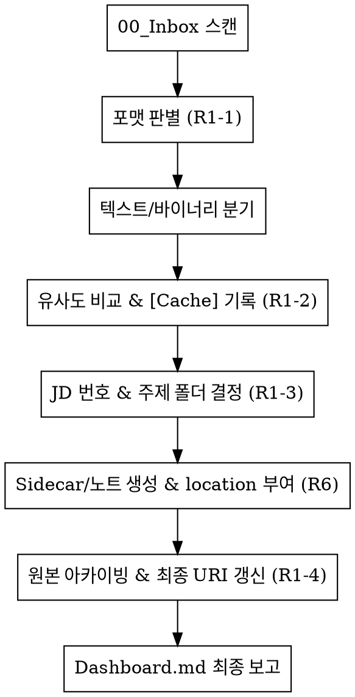

# New File Processor

## Overview
`00_Inbox`에 유입된 신규 파일을 식별하고, Johnny.Decimal 체계와 Sidecar 규칙에 따라 자동으로 분류, 컴파일, 아카이빙하는 강제 워크플로우입니다.

## When to Use
- `00_Inbox`에 처리되지 않은 신규 파일이 존재할 때
- 사용자가 `/defrag:new-file-process`, `/defrag:nfp` 또는 "인박스 처리해줘"라고 요청할 때
- `unsorted/` 디렉토리에 있는 파일을 재배치해야 할 때

## Core Workflow (Rigid)

이 스킬은 **`R1_ingest.md`** 및 **`R2_search.md`**의 절차를 엄격히 준수하며, 단계를 생략할 수 없습니다. 특히 "유사도 비교" 단계에서는 **3단계 탐색 프로토콜**을 필수적으로 거쳐야 합니다.

## Quick Reference

| 단계 | 핵심 액션 | 주요 산출물/로그 |
| :--- | :--- | :--- |
| **준비** | `R1_ingest.md`, `R6_metadata.md`, `R2_search.md` 로드 | - |
| **1단계** | 텍스트 vs 바이너리 판별. **텍스트(.md, .txt)는 분량에 관계없이 2단계 직행** | - |
| **2단계** | 유사도 스캔 (3단계 탐색 프로토콜 적용) | Dashboard `[Cache]` 기록 |
| **3단계** | Johnny.Decimal 번호 + 주제 폴더 배치 | MD 노트 생성/통합, Frontmatter 작성 |
| **4단계** | 위키 이동 후 원본 삭제 (텍스트) 또는 Archive 이동 (바이너리) | `location` (Obsidian URI) 갱신 |

## 구현 가이드 (Implementation)

### 1. 검색 최적화 (Search Optimization)
R1-2의 유사도 비교 스캔을 수행할 때는 반드시 아래 3단계를 순차적으로 적용합니다. (전역 검색부터 실행 금지)
1. **인덱스 스캔:** 유력한 프로젝트 도메인(예: `30_index.md`)만 확인.
2. **디렉토리/파일명 탐색:** `list_directory`, `glob`를 통해 폴더 하위의 파일 목록만 빠르게 확인.
3. **전역 본문 탐색:** 앞의 두 단계로 확인할 수 없는 경우만 `grep_search` 사용.

### 2. 프로젝트 번호 할당 (Johnny.Decimal)
- 기존 프로젝트: 기존 번호(예: `30_`) 유지.
- 신규 프로젝트: 해당 영역의 **최대 번호 + 1** 할당 (예: `31_`).

### 3. Sidecar `location` 필드 (Obsidian URI)
- 반드시 **URL Encoding**된 Obsidian URI를 사용합니다.
- 포맷: `obsidian://open?vault=defrag&file=[Encoded_Path]`

## Automation Policy (Non-interactive Mode)
이 스킬이 비대화형 환경(Headless Mode)에서 실행될 때, `R8_security.md`의 "사용자 확인 요청"이 필요한 상황(모호성, 보안 위험 등)에 직면하면 아래 절차를 따릅니다.

1. **중단 금지**: `ask_user`를 호출하여 실행을 멈추지 않습니다.
2. **안전한 폴백(Fallback)**: 해당 파일을 즉시 `00_Inbox/unsorted/`로 이동시킵니다.
3. **사후 기록**: Dashboard.md에 `[Log] (파일명) 처리 보류: (사유 - 예: PII 감지, 도메인 판단 불가)`를 남기고 즉시 다음 파일 처리를 진행합니다.
4. **결과 보고**: 모든 루프가 끝난 후, 처리 완료 건수와 'unsorted'로 이동된 건수를 요약 보고합니다.
5. **침묵 유지 (Silence on Empty)**: 처리할 신규 파일이 하나도 없는 경우, Dashboard.md를 포함한 어떠한 곳에도 로그를 남기지 않고 즉시 종료합니다.

## Common Mistakes
- **주제 폴더 누락 및 번호 금지**: 프로젝트 루트(예: `30_Project-X/`)에 파일을 직접 두지 마십시오. 반드시 `참고자료`, `회의록` 등 하위 폴더를 생성하십시오. **하위 주제 폴더명에는 `[번호]_` 접두사를 절대 붙이지 마십시오.** (예: `10_Admin/Network/` (O), `10_Admin/10_Network/` (X))
- **Cache 기록 누락**: 수집 시작 시 Dashboard에 `[Cache]`를 남기지 않으면 중복 수집의 원인이 됩니다.
- **절대 경로 사용**: `location`에 OS 절대 경로를 절대 사용하지 마십시오.
- **무분별한 전역 검색**: 파일명 스캔 과정 없이 파일 내용 검색(`grep_search` 등)부터 실행하면 막대한 토큰 낭비가 발생합니다.

## Red Flags
- "바쁘니까 아카이빙은 나중에 할게요" (즉시 아카이빙이 원칙)
- "주제 폴더가 애매해서 루트에 둘게요" (반드시 '일반' 또는 '기타' 폴더라도 생성)
- "비슷한 파일이 있는지 확인하기 위해 전역 검색부터 돌렸어요" (위험! 1-2단계 스캔 선행)
